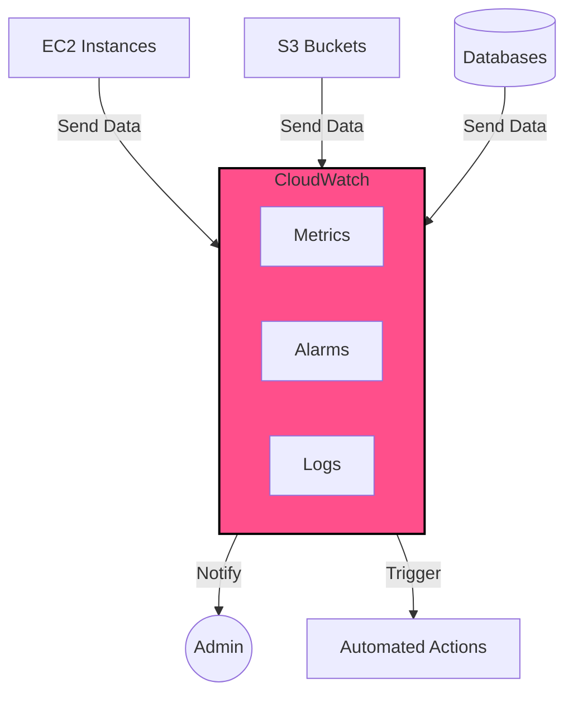

---
tags:
  - technology
  - notes
Parent: "[[2024-10-17]]"
Created Time: 2024-10-17T15:52:00
Last Edited Time: 2024-10-17T15:52:00
Parent 2: "[[Technology]]"
Link: https://claude.ai/chat/dfbf35ca-6f3c-40ca-9b6f-d90b2d73f2c6
---
## ==What is Cloud Watch:==

- Monitoring and Management tool
- Metrics (High usage)
- Alerts
- Logs
- Triggers events 

---
## ==References:==

