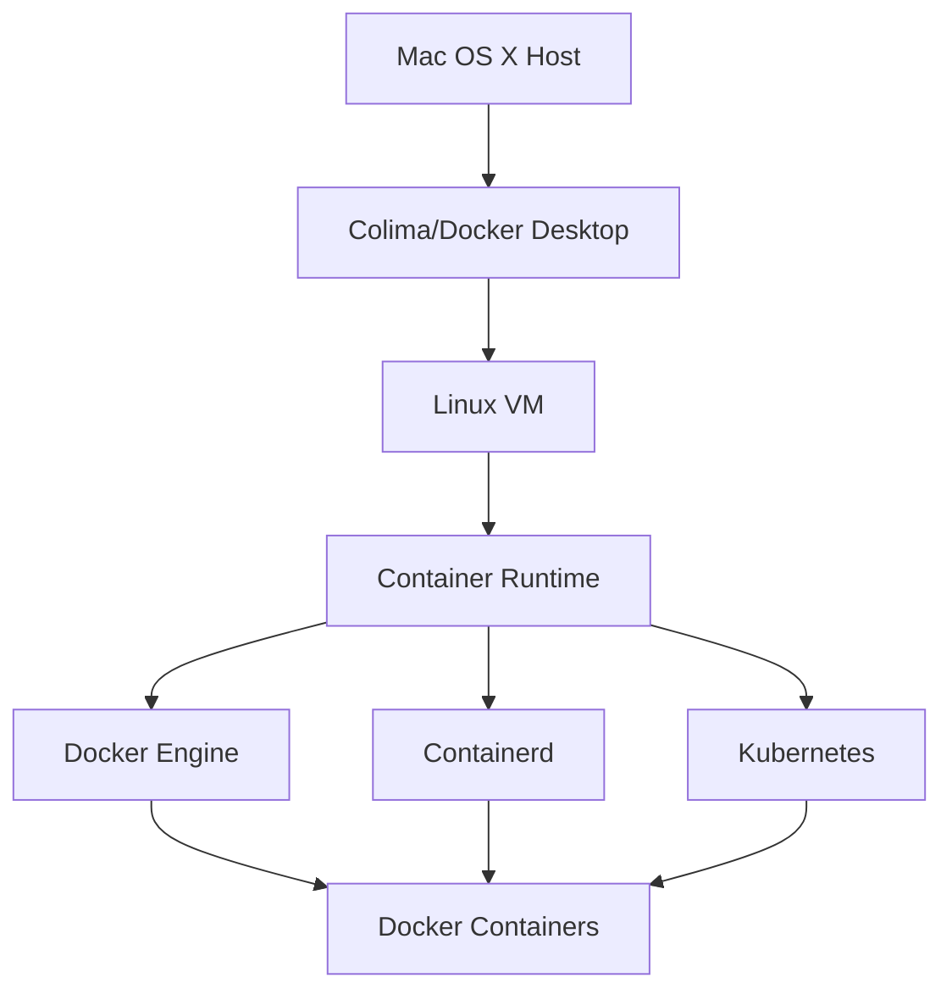

### architecture

### colima provides
- Docker-compatible CLI
- Linux VM for running containers on Mac
- Container runtimes: Docker, Containerd, Kubernetes

### start colima VM
```bash
colima start --cpu 2 --memory 4 --disk 50 --arch x86_64
colima ssh  # SSH into the Linux VM
```