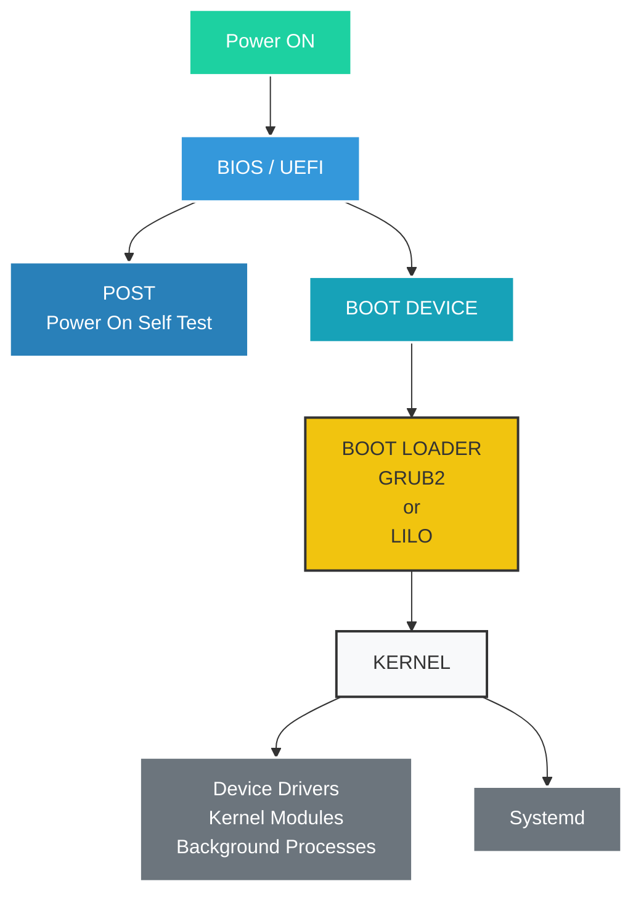

---
tags:
  - to-learn
---
[https://www.youtube.com/watch?v=XpFsMB6FoOs](https://www.youtube.com/watch?v=XpFsMB6FoOs)

[[how-does-linux-boot-process-work-my-notes]]
Summary:  
This video provides an in-depth look at the behind-the-scenes process that occurs when booting up a Linux system. It explains the role of the BIOS or UEFI firmware in initializing hardware, performing the POST (power-on self-test), and loading the boot loader software. It then describes how the boot loader, such as GRUB2, loads the Linux kernel and hands control over to it. The kernel then decompresses itself, checks the hardware, and loads device drivers, before the init process (typically Systemd) takes over to mount file systems, start background services, handle user logins, and load the desktop environment.  
Key Points:
- [0:11] BIOS or UEFI firmware gets the main parts of the computer ready for action.
- [0:36] BIOS is tied to the Master Boot Record (MBR) system, while UEFI uses the GUID Partition Table (GPT), offering more flexibility and better security.
- [0:57] BIOS has slower boot time and less secure boot, while UEFI has faster boot time and secure boot.
- [1:19] The boot loader software is responsible for locating the operating system kernel, loading it into memory, and starting its execution.
- [2:03] Common boot loaders include LILO and GRUB2, with GRUB2 being the most widely used today.
- [2:42] The Linux kernel takes over the computer's resources and starts initiating all the background processes and services.
- [3:01] Systemd is the modern init system that handles many responsibilities to get the system booted and ready to use, such as mounting file systems, starting services, and loading the desktop environment.
![[Untitled 12.png|Untitled 12.png]]

> [!info] ByteByteGo Newsletter | Alex Xu | Substack  
> Explain complex systems with simple terms, from the authors of the best-selling system design book series.  
> [https://blog.bytebytego.com/](https://blog.bytebytego.com

