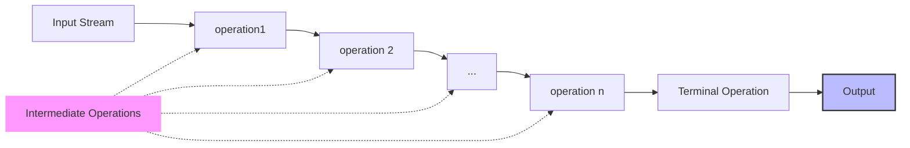

- Iterates over collections sequentially
- There is no chance to modify the original collection
- There is no increased storage
- Internal Iteration
![[Untitled 11.png|Untitled 11.png]]
- Performance is better than for loop and iterator
- We can use multiple intermediate operations on a stream
```Java
.stream()
.filter()
.count()
.map()
.forEach()
.collect()
.parallelStream()
```


