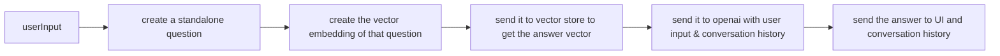
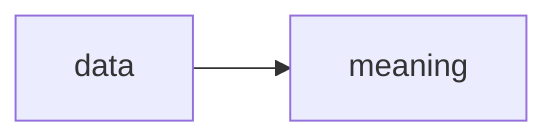
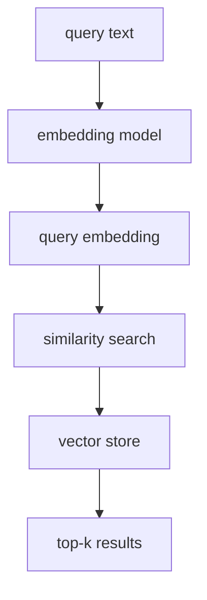
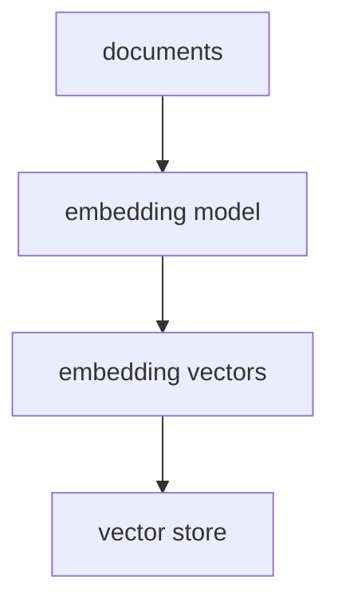

- framework
- to build context-aware reasoning application
- langchain comes in 2 flavours
	- typical python framework
	- langchain.js for web apps

info source -> splitter -> embeddings -> vector store



embeddings - vectors of data - multiple dimensions - each dimension capturing each context to closely represent the vector

embeddings - how AI understands a word

we can do vector arithmetic (King + Woman - Man = Queen) to find new words

related words will be closer in the vector space forming clusters

recommendation engines use these clusters to curate content and what to recommend next to the user

search engines give results that are more semantically accurate rather than keyword matching

what langchain tries to achieve is transform


vector store used here is supabase
- stores embeddings
- performs similarity search

document is an object with page content and metadata

```js
const document = new Document({
	pageContent: "Hi, this is human",
	metadata: {
		source: "tweets",
		date: <DateObject>
	}
})
```

### querying phase while retrieval (application)



## indexing phase in store



> openai's embedding model: text-embedding-3-small, text-embedding-ada-002

### similarity metrics
computed using
- cosine similarity
- euclidean distance
- dot product

HNSW - Hierarchical Navigable Small World - for indexing

```js
vectorStore.similaritySearch("man", 10, {source: "books" })
```

### [[translation challenge code]]
### [[challenge with initial approach]]

### solution
```js
const standaloneQuestionChain = standaloneQuestionPrompt
	.pipe(llm)
	.pipe(new StringOutputParser())

const retrieverChain = RunnableSequence.from([
	prevResult => prevResult.standalone_question,
	retriever,
	combineDocuments
])

const answerChain = answerPrompt
	.pipe(llm)
	.pipe(new StringOutputParser())

const chain = RunnableSequence.from([
{
	standalone_question: standaloneQuestionChain,
	original_input: new RunnablePassthrough() // assigns input object
},
{
	context: retrieverChain,
	question: ({ original_input }) => original_input.question
},
	answerChain
])

const response = await chain.invoke({
	question: 'What are the technical requirements for running Scrimba? I only have a very old laptop which is not that powerful.'

})

console.log(response)
```


### [[final-code]]