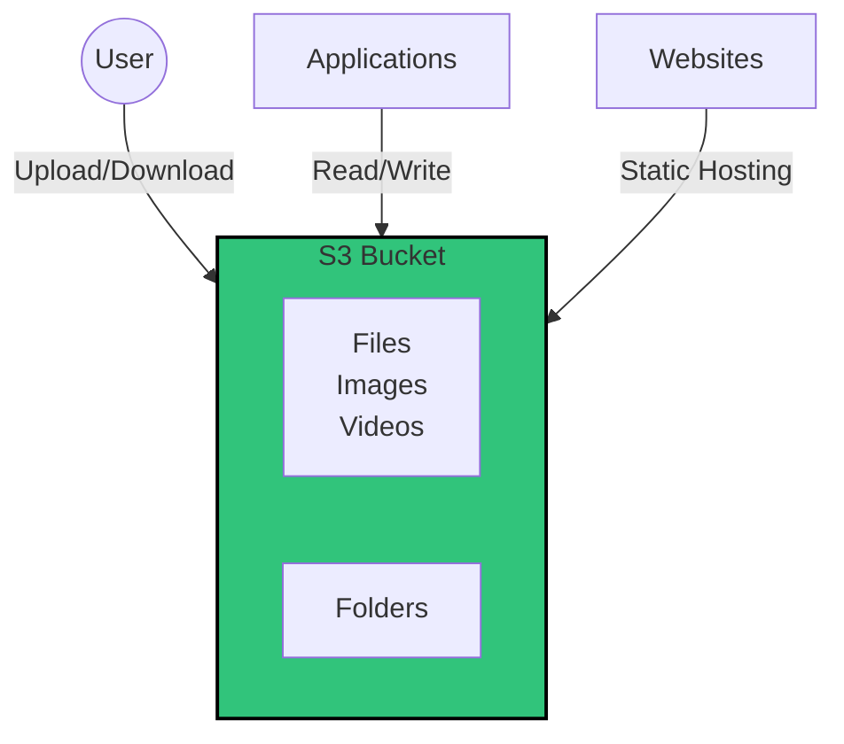

---
tags:
  - technology
Parent: "[[Technology]]"
Created Time: 2024-10-17T15:09:00
Last Edited Time: 2024-10-17T15:09:00
---
## ==What is S3 bucket:==
- Powerful Google Drive or BitBucket
- Images, Videos, Files goes into this
- Static websites can also be hosted
- Built in versioning
- Durable

---
## ==References:==

